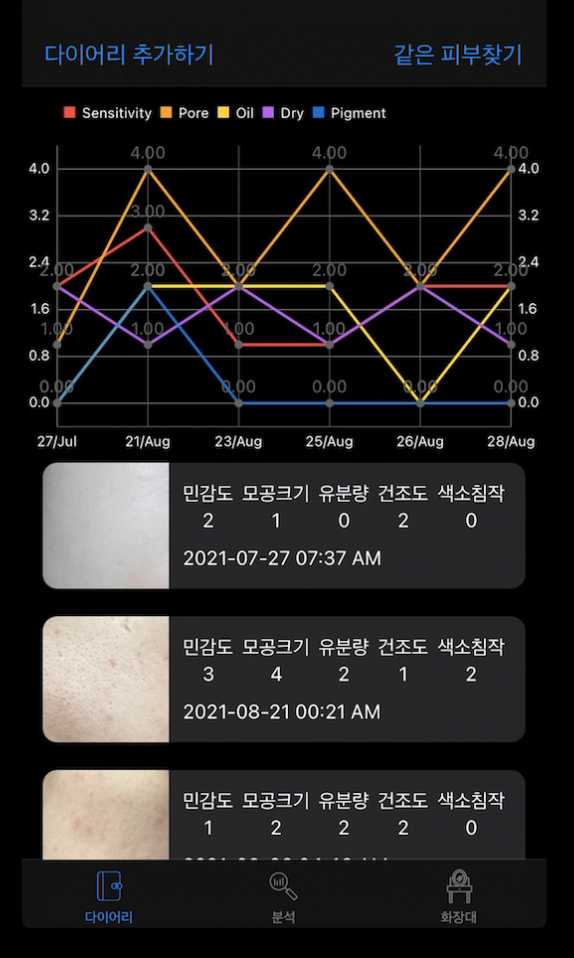
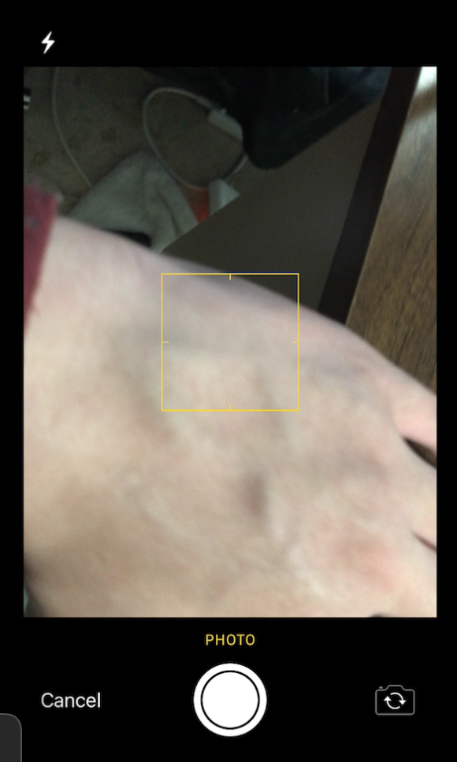
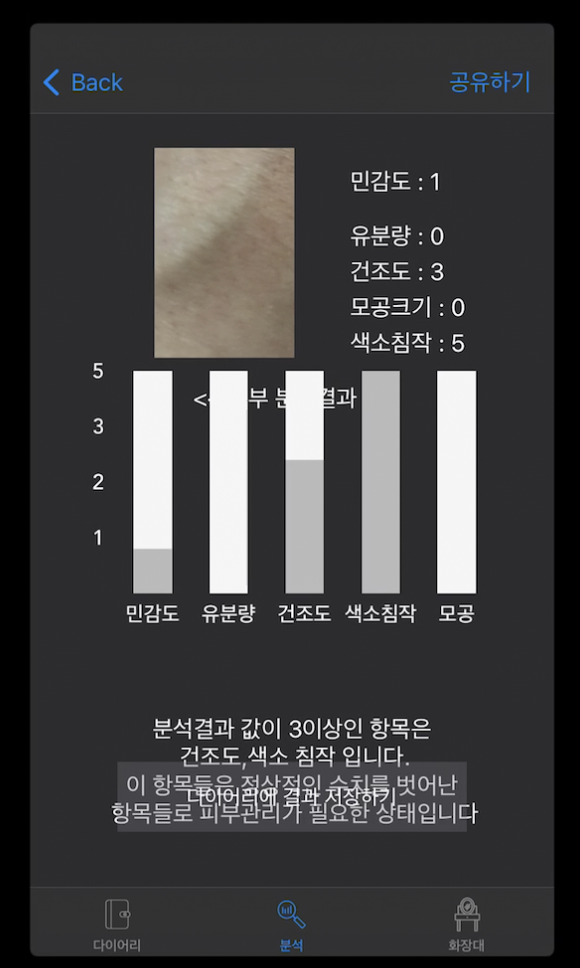

# iOS skin type classificaion applicaion by using Ai 


<div style="display: flex; justify-content: space-around;">
  
  
  
</div>


---
---
<br>


# Overview
This app uses Firebase for login and analyzes skin type from photos using a custom .mlmodel file. 
It identifies 5 key skin attributes: oiliness, dryness, pigmentation, hydration, and pore size. 
Each attribute is rated on a scale of 0 to 5, with 5 indicating extreme oiliness or dryness.

Users take daily photos, and the app tracks their skin attribute scores over time. 
By recording their preferred skincare products, users are connected with others who have similar skin profiles. 


Dry skin often doesn't feel adequately moisturized by lotions or toners designed for oily skin. 
Conversely, oily skin can experience irritation or breakouts from products intended for dry skin.

This allows them to discover and explore products used by people with comparable skin types, addressing the common issue of skincare product mismatch.


**Skin Type Classification Indicators**
The AI model evaluates skin based on the following five indicators, each measured on a **scale from 0 to 5**:
- **Oily** (Higher values indicate excessive oil production)
- **Dryness** (Higher values indicate severe dryness)
- **Pigmentation** (Higher values indicate more visible pigmentation issues)
- **Dehydration** (Higher values indicate higher moisture loss)
- **Pore Size** (Higher values indicate larger and more visible pores)

**Scale Interpretation**  
- `0 → Very Low`  
- `5 → Very High`  
- Higher values for **oily skin** indicate increased oil production.  
- Higher values for **dry skin** indicate extreme dryness.  


---
---
<br>


# Feature


1. Firebase Authentication: 
  - Secure login system for personalized skin analysis.  
<br>

2. AI-Based Skin Type Analysis:
  - Uses an `.mlmodel` file to classify skin conditions from photos.  
<br>
  
3. Daily Skin Tracking:
  - Users can take photos daily to monitor their skin condition over time.  
<br>

4. PNBar Chart Integration:
  - Visual representation of skin condition trends using a bar chart.  
<br>

5. Personalized Skincare Recommendations:
  - Users can log their preferred skincare products.  
  - The app connects users with **similar skin types**, allowing them to see what products others with similar conditions use.  
<br>

6. Preventing Mismatched Skincare:
  - Helps **dry skin** users avoid using **oily skin** products that may lack moisture.  
  - Prevents **oily skin** users from experiencing irritation when using **dry skin** products.  


---
---
<br>

# Core technologies


- **Swift & SwiftUI** - Modern iOS app development  
<br>

- **Core ML** - AI-powered skin type classification using `.mlmodel`  
<br>

- **Firebase** - User authentication and data storage  
<br>

- **PNBarChart** - Visual representation of skin condition trends 
<br>

- **AVFoundation** - Camera integration for capturing skin images  
<br>


---
---
<br>

# Deployment

## 1. Installation

```bash
git clone https://github.com/yourusername/ios-skin-type-classification.git

cd ios-skin-type-classification

```

<br>

## 2. Install Dependencies


```bash

pod install

```

## 3. Open the Project

<br>
Open SkinTypeClassifier.xcworkspace in Xcode.
<br>

## 4. Run the Application
<br>
Select an iOS simulator or physical device.
<br>
Click Run (Cmd + R) in Xcode.
<br>

---
---
<br>


# Full video link 

Youtube : 


[📺 Youtube Link : https://youtu.be/TrqFeDNcTBs ](https://youtu.be/TrqFeDNcTBs)

---
---
<br>

# Demo


---
---